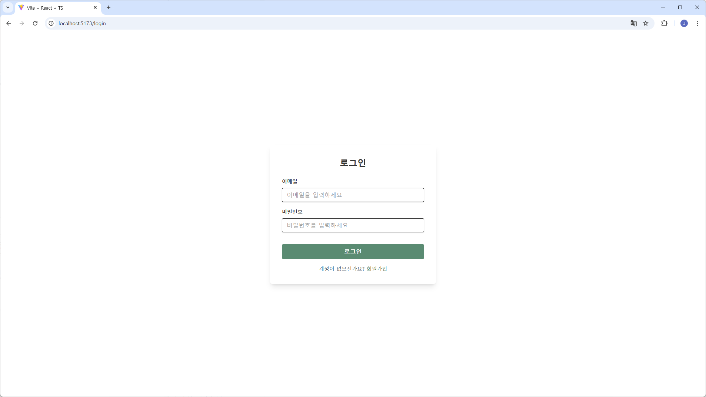
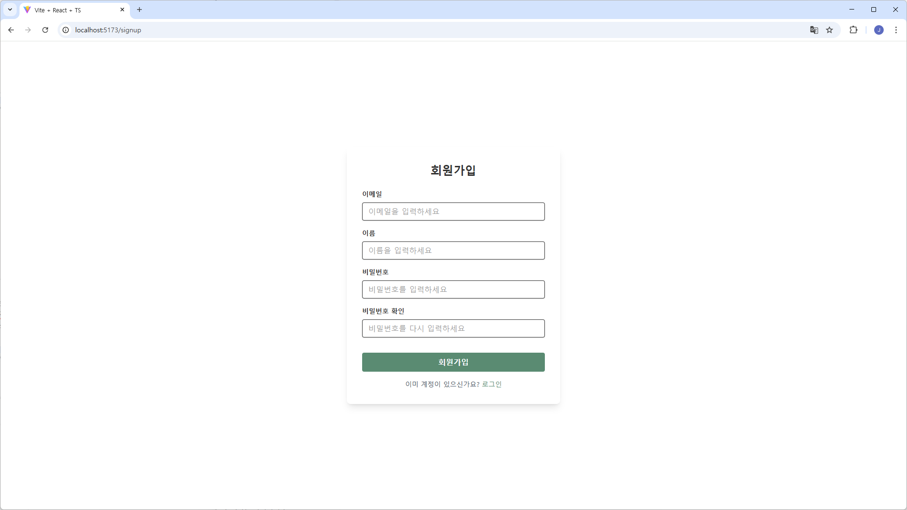
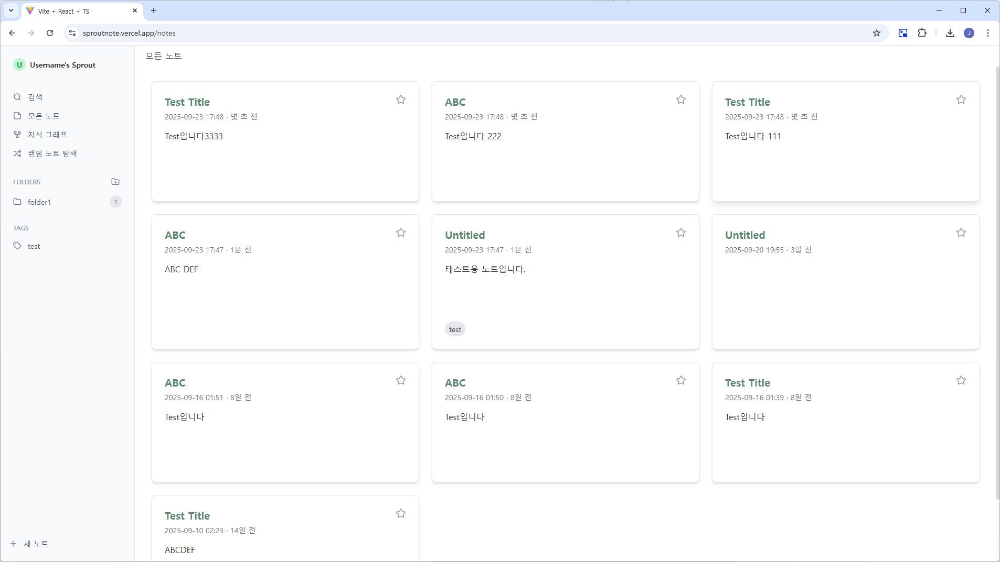
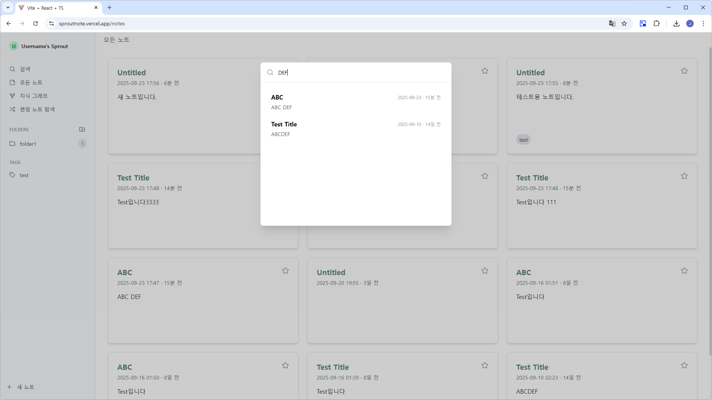
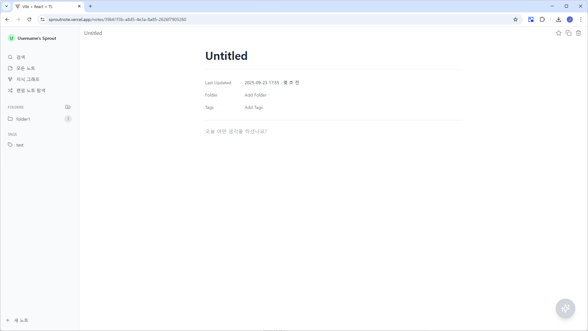
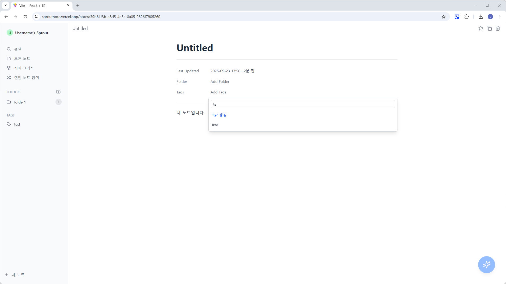
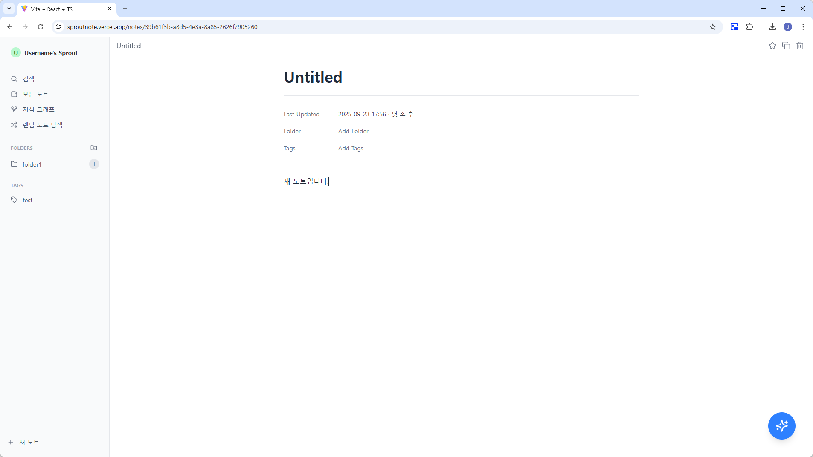
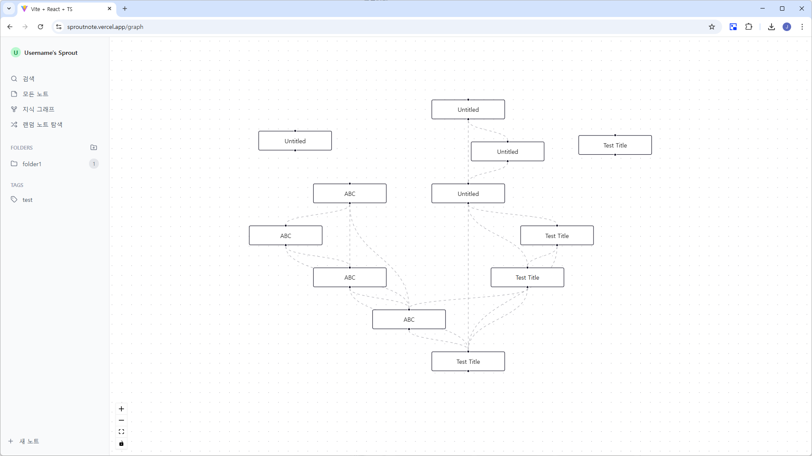
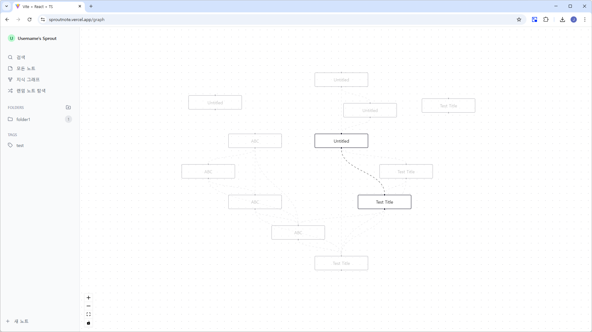

# Sprout : 디지털 정원 노트 서비스

> Kotlin과 Spring Boot, React를 사용하여 진행하고 있는 개인 프로젝트입니다. 잊혀진 노트를 되살리고, 파편화된 생각들을 연결하여 새로운 통찰을
> 얻도록 돕는 지식 관리 및 저널링 앱을 구상하였습니다. 사용자는 노트를 작성하고, 과거에 작성했던 노트를 검색할 수 있습니다. OpenAI API를 사용하여
> 노트의 embedding을 구해 과거에 작성한 노트와의 유사성을 판단하고, 이렇게 연결된 유사 노트 간의 관계를 시각적으로 볼 수 있는 지식 그래프 뷰를
> 확인할 수 있습니다. 또, 랜덤 노트 탐색 기능을 통해 잊혀졌던 노트를 되살리는 등 사용자의 창의적이고 생산적인 활동을 돕는 서비스입니다. Monorepo
> 구조로 프론트엔드와 백엔드 모두 직접 구현하였습니다.

## 🔍 About Sprout

👤 개인 프로젝트

📅 2025.07.16 - In Progress

🔍 [상세 노션 페이지](https://www.notion.so/chloeeekim/Sprout-2466e927bee080a8b714e593f758dfef)

## 🛠️ 사용 기술 및 라이브러리

- **언어 & 런타임**: Kotlin `1.9.25`, JDK `17`, Typescript
- **백엔드 프레임워크**: Spring Boot `3.5.3`, Spring Security, JWT (JJWT), SSE (Server-Sent Events)
- **데이터 접근**: Spring Data JPA, Spring Data Redis, QueryDSL
- **데이터베이스 & 마이그레이션**: PostgreSQL `17.5`, Redis, Flyway
- **메시지 큐**: Kafka, SQS (Spring Profile 기반 선택 가능)
- **테스트**: MockK, Spring MockK
- **프론트엔드**: React `19.1.0`, Tailwind CSS, Axios, Vite, React Flow, dagre, d3-force
- **모노레포**: Turborepo
- **AI**: OpenAI API (임베딩 생성)

## 🚀 배포 및 운영

- **클라우드 서비스**: AWS Elastic Beanstalk (Spring Boot), Vercel (React), Amazon CloudFront, S3
- **데이터베이스 / 캐시**: RDS (PostgreSQL), ElastiCache (Redis)
- **메시지 큐**: SQS
- **CI/CD**: Github Actions

## 👩‍💻 구현 내용

1. **사용자 인증 및 권한 관리 (JWT + Spring Security)**
    - 회원가입, 로그인, 로그아웃 기능 구현
    - Access Token / Refresh Token을 통한 인증 시스템 구축
    - Spring Security 필터 커스터마이징으로 요청별 인증 처리
    - `BCryptPasswordEncoder` 를 사용하여 비밀번호를 암호화하여 DB에 저장
    - Refresh Token은 Redis에 저장하고 자동 만료되도록 설정
    - Token Blacklist 기반 로그아웃 기능 구현

2. **노트 CRUD 및 pg_trgm 기반 전체 텍스트 검색 기능 구현**
    - 노트에 대해 등록, 수정, 삭제, 검색 기능 구현
    - PostgreSQL의 `pg_trgm`(Trigram 기반 문자열 유사도 검색) 확장을 통해 title 및 content에 대한 유사도 기반 검색 지원
    - 두 컬럼에 대해 GIN 인덱스를 생성하여 LIKE 연산 성능 최적화
    - 프론트엔드에서는 검색 시 실시간으로 결과를 갱신하며 사용자 경험 향상

3. **QueryDSL 기반 무한 스크롤 기능 구현**
    - 노트 목록 조회 등에서 무한 스크롤 방식의 데이터 로딩 기능 구현
    - 기존 offset 기반 페이징의 성능 개선을 위해 QueryDSL + No-Offset 방식 적용
    - 태그 기반 필터링 및 키워드 검색 결과에서도 동일한 커서 기반 로직을 적용하여 다양한 조건 하에서도 일관된 페이징 방식 유지
    - QueryDSL 동적 쿼리를 통해, 다양한 필터링 조건(`tag`, `keyword` 등)을 조합하면서도 성능 유지
    - 프론트엔드에서는 `react-infinite-scroll-component` 라이브러리를 사용하여 무한 스크롤 구현

4. **공통 API 응답 포맷 적용**
    - 모든 REST API 응답에 대해 일관된 구조를 적용하기 위해 제네릭 기반 `ApiResponse<T>` 클래스 구현
    - 성공/실패 여부(`success`), HTTP 상태 코드(`status`), 응답 코드(`code`), 메시지(`message`), 요청 경로(`path`), 응답 데이터(`data`), 타임스탬프(`timestamp`)를 포함한 표준화된 응답 형식 설계
    - `@RestControllerAdvice`를 활용하여 예외 상황 뿐만 아니라 성공 응답에 대해서도 일관된 형태로 반환되도록 설계

5. **MockK 및 Spring MockK를 활용한 테스트 코드 작성**
    - Kotlin에 최적화된 MockK 라이브러리를 사용하여 단위 테스트 작성
    - Spring Boot와의 연동 테스트를 위해 Spring MockK를 활용하여 의존성이 주입된 빈을 모킹하여 테스트 수행
    - 테스트 코드 작성 시 BDD 스타일(`every`, `verify`)을 적용하여 가독성과 유지보수성 증가

6. **React 기반 프론트엔드 구현**
    - React를 사용하여 사용자 인터페이스 구현
    - Axios를 통해 백엔드 API와 통신
    - 노트 목록 등에는 `react-infinite-scroll-component` 라이브러리를 사용하여 무한 스크롤 기능 구현
    - Tailwind CSS를 도입하여 빠르고 유연한 UI 스타일링 구현
    - lucide-react 아이콘 라이브러리를 사용하여 깔끔하고 일관된 UI 아이콘 구성
    - dayjs 라이브러리를 도입해 날짜 및 시간 포맷을 간결하게 처리
    - debounce 기법을 적용하여 실시간으로 검색이 가능하면서 불필요한 API 호출을 방지

7. **Turborepo 기반 모노레포 프로젝트 구조 관리**
    - Turborepo를 활용하여 프론트엔드(React)와 백엔드(Spring Boot)를 하나의 모노레포로 통합 관리
    - 1인 개발 프로젝트의 생산성과 유지보수 편의성을 고려하여, 단일 레포지토리 내에서 전체 서비스 구조를 명확히 분리
    - `apps/` 디렉터리에 `frontend`, `backend`를 구성하고, `packages/`에 공통 타입 관리
    - 각 앱은 독립적으로 개발 및 빌드 가능

8. **Flyway를 활용한 데이터베이스 마이그레이션 자동화**
    - Flyway를 도입하여 데이터베이스 스키마 변경 내역을 코드로 관리하고, 자동으로 마이그레이션 수행
    - SQL 스크립트를 버전별로 체계적으로 작성하여 변경 이력 관리
    - 어플리케이션 실행 시점에 Flyway가 자동으로 최신 스키마로 데이터베이스를 동기화하여 수동 작업 최소화

9. **OpenAI API를 활용한 AI 기능 구현**
    - OpenAI API를 사용하여 텍스트 임베딩 생성
    - 유사 노트 추천 시스템에 임베딩 기반 유사도 계산 적용
    - 메시지 큐(Kafka, SQS)를 활요하여 API 호출을 비동기적으로 처리

10. **SSE 기반 실시간 알림 기능 구현**
    - OpenAI API 요청이 완료되고 유사 노트가 업데이트되면, SSE(Server-Sent Events)를 통해 프론트엔드로 알림 전송
    - 프론트엔드는 수신된 알림을 기반으로 필요한 API를 호출하여 UI 및 데이터 갱신

11. **유사 노트 기반 지식 그래프 시각화**
    - ReactFlow를 사용하여 노트 간의 관계를 그래프로 시각화
    - 위치 결정 방식:
        - 서로 연결된 노트들끼리는 dagre를 사용하여 구조화된 위치 배치
        - 연결되지 않은 노트들은 d3-force를 사용해 주변에 자연스럽게 뿌려지는 느낌으로 배치
    - 사용자 인터랙션을 통해 그래프를 확대/축소, 이동 가능하도록 구현하여 직관적인 시각화 제공

12. **배포 및 운영 자동화**
    - AWS Elastic Beanstalk을 사용하여 Spring Boot 백엔드 배포
    - Vercel을 사용하여 React 프론트엔드 배포
    - Github Actions CI/CD를 구성하여 백엔드 코드 변경 시 자동 빌드 및 배포
    - RDS(PostgreSQL)와 ElastiCache(Redis) 연동으로 안정적인 데이터 및 캐시 관리
    - SQS를 활용한 비동기 메시지 처리 및 서비스 확장성 확보
    - CloudFront를 사용하여 SSL 연결 적용
    - Kafka 및 SQS 메시지 큐를 Spring Profile 기반으로 선택하여 사용, 서비스 환경에 따라 동적으로 구성 가능

## 📐 Architecture

- System Architecture

- Deployment Architecture

## 💾 ERD

## 💻 UI 및 기능 구현 화면

- 로그인 / 회원가입 화면
  - 로그인 및 회원가입 기능이 구현되어 있으며, 입력값이 유효하지 않은 경우 적절한 에러 메시지가 출력됩니다.
    
    
- 노트 리스트 화면
  - 전체 노트 리스트를 확인할 수 있으며, 노트를 즐겨찾기 하는 등의 작업이 가능합니다. 노트는 최종 업데이트 시간 기준으로 정렬되며, `몇 초 전`과 같이 상대 시간이 함께 표시됩니다. 노트는 즐겨찾기 표시가 가능하며, 태그 및 폴더를 기준으로 필터링하여 조회할 수 있습니다. 노트 리스트 화면은 무한 스크롤 방식으로 동작합니다.
    
- 노트 검색 기능
  - 사이드바의 검색 버튼을 통해 검색 모달을 표시할 수 있습니다. Title 및 Content를 기반으로 검색되며, 검색 버튼을 별도로 두지 않고, debounce 기법을 사용하여 사용자 입력에 따라 실시간 검색이 가능합니다.
    
- 노트 상세 화면
  - 노트의 내용을 확인하면서 동시에 수정할 수 있습니다. 저장 버튼을 별도로 두지 않고, debounce 기법을 사용하여 사용자 입력에 따라 실시간 저장이 되도록 구현되어 있습니다.
    
  - 태그나 폴더를 추가 및 삭제할 수 있습니다. 폴더는 하나만 선택할 수 있으며, 태그는 여러 개를 선택할 수 있습니다. 또한, 태그의 경우 목록에 없다면 생성도 가능합니다.
    
  - 노트가 업데이트 되는 경우, 백엔드에서는 일정 조건을 만족하면 OpenAI API를 호출하여 노트의 embedding을 구하고, embedding을 기반으로 유사 노트가 업데이트 됩니다. 유사 노트 업데이트 시 프론트엔드로 SSE 방식의 알림을 보내고, 프론트엔드에서는 알림을 수령하면 유사 노트 조회 API를 호출하여 업데이트가 있다면 우측 하단의 floating button이 활성화됩니다.
    
- 지식 그래프 화면
  - 유사 노트들이 어떻게 연결되어 있는지를 시각적으로 확인할 수 있습니다. 특정 노드(Note)나 엣지(Link)를 클릭하면 연결되어 있는 노드 및 엣지에만 하이라이트 처리가 됩니다.
    
    
